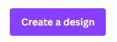
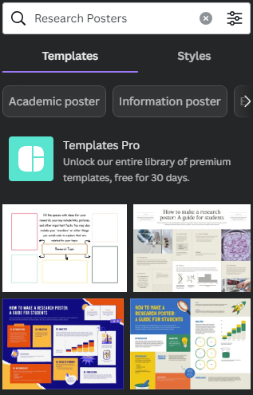

# Find a Template on Canva

In this exercise, you will create an Academic Poster using Canva. If you have any questions or get stuck, please ask your instructor for assistance. 

1.  Create a Canva account at 
[canva.com](https://ww.canva.com/){:target="_blank"}  
2.  Click on the Create a design button on the top right of the screen.  
    - At the bottom of the drop-down that comes up, there is a button for “Custom size”. Click on this to bring up sizing options. 
    - This will bring up the Custom Size options. Click on the little drop down for units (default is “px” for pixels) and change it to “in” for inches.  
    - Type in your chosen size (commonly 48 for Width and 36 for Height or the opposite for vertical)  and then click Create new design. This will open a new tab with a blank canvas to start working in.
<button onclick="toggle('gif1')">Show / Hide Animation </button>

      
      

3. Choose a template: 
   -   The easiest way to use a #BetterPoster format is to use and modify this [UVic branded Template](https://www.canva.com/design/DAF-9Zg5fi4/p3raWJdO9DwZz6H1EcoJbA/view?utm_content=DAF-9Zg5fi4&utm_campaign=designshare&utm_medium=link&utm_source=publishsharelink&mode=preview){:target="_blank"}. 
**-OR-** 
   - You should have templates showing in the left sidebar with a Search field at the top. Type “Research poster” or "Academic poster" in the search field to bring up template ideas. 
   - Scroll through to find a template you like. If you mouse over them, you may notice that many of them will start to move like a slideshow, indicating multiple pages. These extra pages are just there to provide extra, optional matching content that fit the theme of the template (e.g., charts and graphs and/or graphics and text boxes) that you can move to your main page if you need them.    
    - Once you find a template you like, click on it. If it has multiple pages, it will ask if you want to apply the other pages. Click the “apply both/all pages” button. You can discard the extra pages when you are finished designing your poster.

<button onclick="toggle('gif2')">Show / Hide Animation </button>

      
      

      
-How to resize in Canva: 
   - with your chosen template left open, open an additional browser tab and go to the Canva home page
   - follow the above steps to create another poster, this time with your other required size (e.g., 54x36")
   - go back to the tab containing your chosen template and select all of the content on the template (this can be done by clicking and dragging the mouse across the entire design -- feel free to ask for assistance if you need help with this step)
   - with everything selected, you can right-click with your mouse to bring up a menu with the option to copy everything (alternatively you can use the keyboard shortcut of Ctrl-C or Command-C)
   - go to your new tab with the blank poster in the correct size and paste the contents from the other template into the blank canvas.
   - You will need to resize the contents. If everything is still selected, you can grab the corner and drag it all to match the size of the template. 

[NEXT STEP: Customize Your Poster Activity](act-2.html){: .btn .btn-blue }
