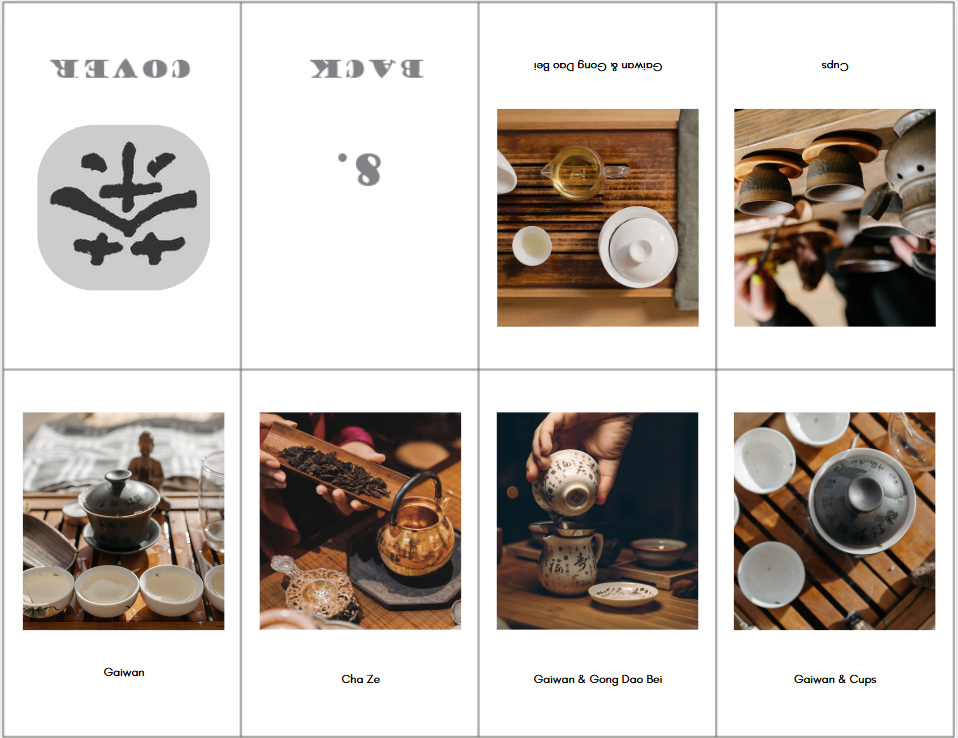

# Create a One-Page Fold and Cut Mini-Zine on Canva

In this exercise, you will create a One-Page Fold and Cut Mini-Zine using Canva. This type of zine uses a single sheet of paper with all of the design on one side. If you have any questions or get stuck, please ask your instructor for assistance. 

1.  Create or log into your Canva account at [canva.com](https://ww.canva.com/){:target="_blank"}  
2.  Click on the Create a design button on the top left of the screen.  
    - Toward the bottom left of the window that comes up, there is an option for “Custom size”. Click on this to bring up sizing options. 
    - This will bring up the Custom Size options. Click on the little drop down for units (default is “px” for pixels) and change it to “in” for inches. 
    - Type in your chosen size to match the paper size you want to use (letter: 11x8.5, legal: 14x8.5, tabloid: 17x11) and then click Create new design. This will open a new tab with a blank canvas to start working in.

3. Upload a template: 
   -  We have created some layout guides to use as backgrounds when designing your zine, so that you know where the folds will be and what direction your graphics will need to face in order to be upright when printed and folded. Choose the correct size and style you want for your zine:
           a. [8 Page Letter](images/8pageSingleTemplate.png){:target="_blank"}{:target="_blank"}
           b. [8 Page Legal](images/8pageSingleLegalTemplate.png){:target="_blank"}
           c. [8 Page Tabloid](images/8pageSingleTabloidTemplate.png){:target="_blank"}
           d. [16 Page Letter](images/16pageSingleLetterTemplate.png){:target="_blank"}
           e. [16 Page Legal](images/16pageSingleLegalTemplate.png){:target="_blank"}
           f. [16 Page Tabloid](images/16pageSingleTabloidTemplate.png){:target="_blank"}
   -  If your browser doesn't automatically download the image, you may need to right-click on it with your mouse and choose "save image as" or "download" to save the layout guide to your computer.
   -  Back in Canva, click on the Uploads icon in the far left sidebar menu and then click on "Upload files" to choose the the layout guide you saved on your computer. Once you find and select it, click on Open.
   -  Once it is uploaded, click on it to add it to your design. Resize if necessary.
 
         <button onclick="toggle('gif5')">Show / Hide Animation </button>

      
      

4. Customize your zine by adding images and text. See the next activities for some instructions. Remove the layout guide if it's visible once you're finished making your design. 

5. To fold your zine once you are finished, see these video tutorials (depending on the style you chose):
   -  [8 page](https://youtube.com/shorts/2LDyKQLEMtw?feature=shared){:target="_blank"}
   -  [16 page](https://youtu.be/bkUxrDfgv8U?feature=shared){:target="_blank"}

[NEXT STEP: Customize Your Zine Activity](act-3.html){: .btn .btn-blue }
