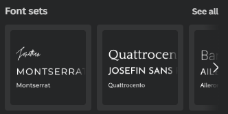

# Customize Your Canva Design

In this exercise, you will add to or change elements in your Canva design. If you have any questions or get stuck, please ask your instructor for assistance. 

1.  ****Customize a pre-designed template using Styles:** 
    -   Click on the arrow at the top of the left sidebar next to the template title to get back into the templates menu or click on the Design icon at the top of the left sidebar menu. 
    -   Click on the Styles tab. Make sure the Search field is empty. In this new sidebar menu there are various helpful tools for designing your zine. 
    
      <button onclick="toggle('gif1')">Show / Hide Animation </button>

      
      

      
a.  Font Sets:
    -   Clicking on “see all in “Font Sets” will bring up various font combinations Canva suggests together,  with 1-3 fonts (sometimes one font will have different variations within the same font, e.g., light and bold). 
    -   You can click on them to apply them to your design and the largest font will be set to your titles or heading, the medium font to your sub-headings, and the smallest to your body text. You can click through various sets to see how this changes the feel of your poster.
  
b.  Color Palettes:
    -   Going into “see all” in Color Palettes will bring up various color combinations. Clicking on one will apply it to your template. Clicking on the same one again will use the same colours but apply them to different areas of the template, which will change the whole feel of the template even with the same few colours. 

      <button onclick="toggle('gif2')">Show / Hide Animation </button>

      
      

2.  **Adding Elements:**
    -   If you would like to search for more clipart, charts, or photos to add to your zine, click on the Elements icon in the far left sidebar menu.
    -   Many clipart items can have their colours customized. To edit the colours, click on the clipart in your poster to select it and then click on the colour tiles in the top menu to bring up the colour menu and select a replacement colour. 

      <button onclick="toggle('gif4')">Show / Hide Animation </button>

      
      

      
3.  **Uploading Graphics:** 
    -   To upload your own graphics, such as a logo or photos or your own art, click on the Uploads icon in the far left sidebar menu and then click on "Upload files" to choose the files on your computer. Once you find and select them, click on Open.
    -   Tip: High resolution PNG files with a transparent background usually work well in designs.

        <button onclick="toggle('gif5')">Show / Hide Animation </button>

      
      

      
4.  **Creating a QR code is a great way to point folks to a website and further reading on your topic:** 
    -   Click on the **Apps** button in the far left navigation bar (see image).
    -   Click on the **QR Code icon** in the Create Something New section. 
    -   Paste the URL into the white field that appears, and then click on the **Generate code button**.
    -   Move the QR code that appeared on your design to where you would like it and resize it to fit the space available.

        <button onclick="toggle('gif6')">Show / Hide Animation </button>

      
      

      

[NEXT STEP: Photo Frames and more Activity](canva-photo-frames.html){: .btn .btn-blue }
