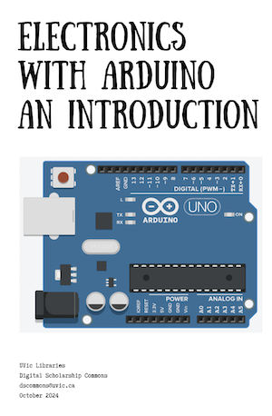

**UPDATE PHOTO**

# Zines 101

- Pre-workshop activities: 10 min 
- Introductory presentation: 15 min
- Hands-on activities: 65 min

## What is a Zine & Why Make One? 

Zines are self-published works with a limited print run, typically created to share thoughts, feelings, creativity, experiences, and knowledge rather than for monetary profit. Zines are part of a DIY culture that often includes people from marginalized communities or those who lack access to mainstream publishing options.

While there is no official definition of a zine, most people agree that they are self-published works with a limited print run, ranging from a few to around 5,000 copies. Zines are typically made up of a variety of images, texts, and messages.The content of a zine is limited only by the creator's imagination. Some examples of what can be included in a zine include:
- Sketches, drawings, and mini-comics
- Recipes with whimsical illustrations
- Words mixed with images and textures
- Poetry

## A Short History of Zines

The history of the zine can be traced back to the fanzines created by science fiction enthusiasts in the early twentieth century. These fanzines served as a forum for dialogue free from corporate editors or publishers. The same DIY ethos drew punks in the late twentieth century to embrace fanzines as a complement to their music and a means to challenge mainstream ideologies. In the 1980s and 1990s, zines became central to movements like Queercore and Riot Grrrl, which used zines to subvert dominant and patriarchal ideologies by sharing lived experiences. Despite corporate appropriation, zine-making remains a cornerstone for marginalized voices to disseminate information and publish creative work.

## Learning objectives

At the end of this workshop, you will be able to:

1. Identify the differences between manual coding and coding with qualitative coding software
2. **MORE OBJECTIVES**
 
[NEXT STEP: Pre-Workshop Activities](pre-workshop.html){: .btn .btn-blue }
